<div align="center">

<a href="https://krishmal2004.github.io">
  
</a>


<a href="https://github.com/Krishmal2004?tab=repositories"></a>
<a href="https://github.com/Krishmal2004?tab=followers"></a>


<a href="https://krishmal2004.github.io"></a>

</div>



## `>_ cat about.json`


```json
{
  "name":     "Krishmal Dinidu",
  "role":     "Software Developer & AI Researcher",
  "uni":      "SLIIT — Sri Lanka Institute of IT",
  "based":    "Colombo, Sri Lanka",
  "focus":    ["Brain-inspired AI", "Spiking Neural Networks"],
  "building": ["Web platforms", "Mobile apps", "Dev tools"],
  "learning": ["Rust", "Go", "Identity & Security"],
  "motto":    "Always learning, always shipping."
}
```

```bash
$ uptime
> online since 2024 · coding daily · coffee: ∞
```

<br clear="right"/>


## `>_ ls ./skills --all`

<div align="center">

| `$ lang` | `$ frameworks` |
| :---: | :---: |
|  |  |
| **`$ data & ml`** | **`$ cloud & tools`** |
|  |  |

</div>


## `>_ ls -la ./projects`

```text
drwxr-xr-x  React-SEO          TypeScript   composable React SEO toolkit
drwxr-xr-x  CertVerifySystem   C#           signed certificates + public verification
drwxr-xr-x  Public-Transport   JavaScript   SLTB DepotOps — bus depot ops dashboard
drwxr-xr-x  MTR                Rust         terminal UI app (tui-rs)
drwxr-xr-x  WordSay            Dart         Flutter mobile app
drwxr-xr-x  power-consumption  Python       household energy ML model
```

<details open>
<summary><b><code>$ cat ./projects/README --featured</code></b></summary>
<br/>

| # | Project | What it does | Stack | Links |
| :-: | :--- | :--- | :--- | :--- |
| 01 | **React-SEO** | Component + hook APIs for title templates, Open Graph, Twitter Cards, canonical, robots & language alternates |   | [`repo`](https://github.com/Krishmal2004/React-SEO) |
| 02 | **CertVerifySystem** | Stops fake certificates by digitally signing every certificate issued, and lets anyone verify the signature |  | [`repo`](https://github.com/Krishmal2004/CertVerifySystem) · [`live`](https://cert-verify-system.vercel.app) |
| 03 | **SLTB DepotOps** | Dashboard tackling ~2,000 idle SLTB buses — breakdowns, maintenance & spare-part tracking |  | [`repo`](https://github.com/Krishmal2004/Public-Transport) · [`live`](https://public-transport-one.vercel.app) |
| 04 | **MTR** | Terminal UI application written in Rust |  | [`repo`](https://github.com/Krishmal2004/MTR) |
| 05 | **WordSay** | Cross-platform mobile app |  | [`repo`](https://github.com/Krishmal2004/WordSay) |
| 06 | **Power Consumption ML** | Machine learning on household power consumption data |  | [`repo`](https://github.com/Krishmal2004/House_hold_power_consumption) |

</details>

<details>
<summary><b><code>$ cat ./research/brain-labs</code></b></summary>
<br/>

```yaml
lab:      BrAIN Labs Inc.
area:     brain-inspired AI · neuroinformatics
topics:   [Spiking Neural Networks, STDP, Brian2, computational neuroscience]
repos:    [BrAINLabsInc-official-web, brain-labs-portal, mindflow-platform]
```

</details>


## `>_ git log --author=Krishmal2004 --open-source`

```diff
+ [merged]  Goverment-Service/Government_Service_Navigator   40+ PRs   backend · dashboards · TUI runner · NeonDB · CI
+ [merged]  openschool-org/openschool                        3 PRs     Phase A features · SonarQube fixes
+ [merged]  Mozilla-Campus-Club-of-SLIIT/certify-v2-fe                 certificate verification page
+ [merged]  Mozilla-Campus-Club-of-SLIIT/codenight-n3-GO               challenge questions · points system
+ [merged]  HasithaErandika/loregrep                                   stage 01 implementation
! [review]  cisco/openh264                                             bug fix
! [review]  hashgraph-online/hol-guard                                 new feature
```

<div align="center">
<a href="https://github.com/pulls?q=is%3Apr+author%3AKrishmal2004+-user%3AKrishmal2004"></a>
</div>


## `>_ ./stats --live --watch`

<div align="center">
  
  
  
  <sub><code># cards regenerated daily by GitHub Actions — no third-party services</code></sub>
</div>

## `>_ python snake.py --eat-contributions`

<div align="center">
  <a href="https://github.com/Krishmal2004/contribution_snake">
    
  </a>
</div>


## `>_ ping krishmal`

<div align="center">

<a href="https://krishmal2004.github.io"></a>
<a href="https://linkedin.com/in/krishmal-dinidu-a933b4349"></a>
<a href="https://discordapp.com/users/krishmaldinidu_62534"></a>
<a href="mailto:krishmaldinidu5466@gmail.com"></a>

</div>

```bash
PING krishmal (127.0.0.1): 56 data bytes
64 bytes from krishmal: icmp_seq=0 ttl=64 time=0.42 ms   # open to collabs
64 bytes from krishmal: icmp_seq=1 ttl=64 time=0.38 ms   # open to internships 🚀
--- krishmal ping statistics --- 2 packets transmitted, 2 received, 0% packet loss
```


